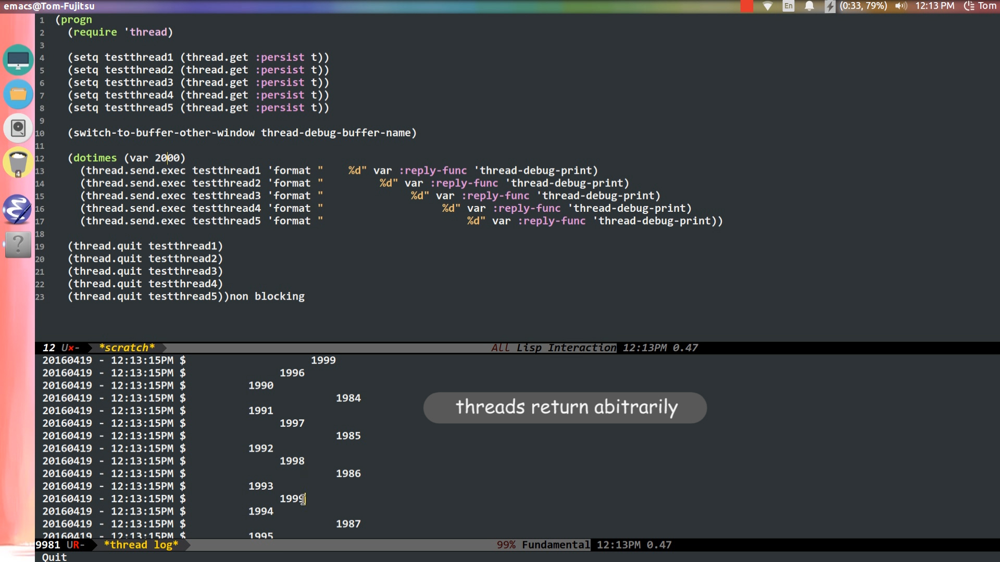
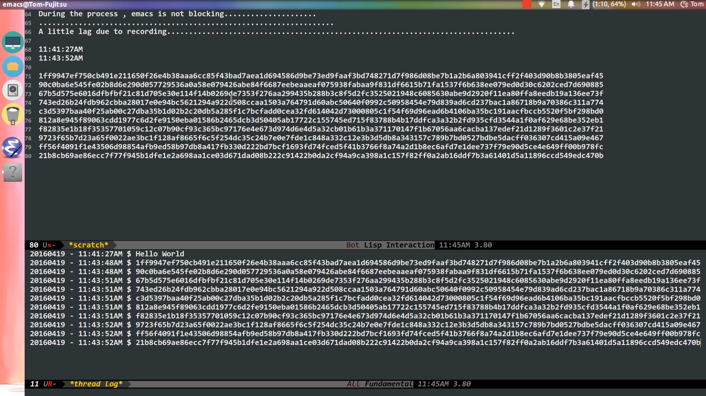

[](http://melpa.org/#/timp)

# Timp

The first multithreading elisp library.

It is intended and indeed esay to use.

(It is previously named `thread`. In order to compile with [melpa](https://melpa.org/)'s regulation, the package is renamed to `timp`.
You may think of `timp` is an alias of `thread`.)

## Requirement

* Emacs 24.4
* Network adapter

## Dependency

* fifo.el - https://github.com/mola-T/fifo-class
* signal.el - https://github.com/mola-T/signal

## Demonstration (Image linked to youtube)

<a href="https://www.youtube.com/watch?v=Da0TjVRp4MM"
target="_blank"></a>

<a href="https://www.youtube.com/watch?v=yVcIx3tkGgo"
target="_blank"></a>


<br>
______________________________
<br>

## Learn how to use `timp` in less then **1 minute**

No one like learning, myself included. So `timp` is designed to minimize the learning cureve.

There are **ONLY 6 functions** you need to use to create a multithread program. If you have experience in concurrency in other languages, you know how to use these functions without my explanation.

1. [`timp-validate`](#timp-validate-object) --                               Self-explanatory enough?
2. [`timp-get`](#timp-get-key-name-persist-quit-warn) ---------              Self-explanatory enough? Create and return a new thread.
3. [`timp-send-exec`](#timp-send-exec-thread-function-rest-arguments-key) -   Send executing instruction to thread.
4. [`timp-send-code`](#timp-send-code-thread-key-code-other-keys) -           Same as `timp-send-exec` but send code to thread.
5. [`timp-quit`](#timp-quit-thread) --------                                 Self-explanatory enough?
6. [`timp-force-quit`](#timp-force-quit-thread) -                               Self-explanatory enough?

Well, simple enough? No.

Among these **6 functions**, you use only four of them in general. There is **ONLY** one pattern using them.

* `get` > `send` > `send` > `send` > .......... > `quit`

So that's all.

In the section below, I provide example riched guide for these **6 functions**.

Again, I need to remind you that this library provides only these **6 functions** because I am so lazy ...

<br>
_______

<br>

## Basic Usage

##### Require this library

```elisp
(require 'timp)
;; Just add this to the top of your package...
```

<br>

##### `(timp-validate object)`

This is the first function you need to know. It tells you two information:

1. whether object is a thread
2. if object is a thread, whether it is valid.

Valid means you can push jobs to the thread.

```elisp
(timp-validate "abc")
;; ==> nil
;; because "abc" is not a thread

(setq my-thread (timp-get))
;; timp-get is to create a new thread.
;; It will be covered soon
(timp-validate my-thread)
;; ==> t
;; Now my-thread is a valid thread.

(timp-quit my-thread)
;; timp-quit is to close a thread.
;; It will be covered soon
(timp-validate my-thread)
;; ==> nil
;; Now my-thread is NOT a valid thread.
```

<br>

##### `(timp-get &key name persist quit-warn)`

`timp-get` is the *ONLY* function that creates a thread.

The `name` argument let you to give the name to the thread.
In fact, it does nothing but to let you identitfy the thread when calling
`list-process` or `process-list`. Personlly, I always ignore it.

The `persist` argument is very important.
It stated whether the thread should be persisted.
If it is nil, after a single instruction, the thread quits automatically.
If it is t, the thread persists and you are responsible for quiting the thread
either by `timp-quit`(better) or `timp-force-quit`."

I will leave `quit-warn` to thre next-section.

```elisp
(setq my-thread (timp-get))
;; Obtain a non-persist thread.

(timp-validate my-thread)
;; ==> t

(timp-send-exec my-thread 'message "Hello world.")
;; timp-send-exec is to send an instruction to the thread.
;; It will be covered soon.

(timp-validate my-thread)
;; ==> nil
```

```elisp
(setq my-thread (timp-get :persist t))
;; Obtain a persist thread.

(timp-validate my-thread)
;; ==> t

(timp-send-exec my-thread 'message "Hello world.")
;; timp-send-exec is to send an instruction to the thread.
;; It will be covered soon.

(timp-validate my-thread)
;; ==> t

(timp-quit my-thread)
(timp-validate my-thread)
;; ==> nil
```

<br>

##### `(timp-send-exec thread function &rest arguments &key......)`

This is the first function (of two) allowing you to send jobs to threads.
You can see there are `key` in the end. I would leave them for now.
Without the `key` we can still have pretty functional threads.

From now on, I will ignore `(setq my-thread (timp-get :persist t))` and `(timp-quit my-thread)`
in all examples assuming that you know they are always there.

`thread` is the thread object you request from `timp-get`.

`function` is the function to be execute in child thread.

`arguments` are the arguments provided to `function`.

```elisp
(timp-send-exec my-thread 'message "Emacs finally have %s in %d" "multithreading" 2016)
;; ==> t
;; ==> Emacs finally have multithreading in 2016
;;
;; The first return t, let you know the job has been quened up in the thread.
;; However, it does not guarantee a return. Just to let you know the job will be processed.
;;
;; When does it return a nil?
;;
;; (timp-quit my-thread)
;; (timp-send-exec my-thread 'message "Emacs finally have %s in %d" "multithreading" 2016)
;; ==> nil
```

Sending single instruction repeatedly is sometimes trouble.
You can use lambda form in `function`

```elisp
(timp-send-exec my-thread (lambda ()
                              (make-directory "~/testdirectory")
                              (make-directory "~/testdirectory2")
                              (make-directory "~/testdirectory3")))

;; ==> t
;; It creates 3 directories in your home folder.
```

What if I make an error in the instruction?

```elisp
(timp-send-exec my-thread 'message 1 2 3 4 5 6)
;; ==> t
;; nothing happen
```

<br>

##### `(timp-send-code thread &key code ....other-keys)`

This is another function let you to send instruction to child thread.
Still, there is other keys we will leave it now.
It works very similar to `timp-send-exec` expect it sends code.

```elisp
(timp-send-code my-thread
                :code `(progn
                         (message "Emacs is great now.")
                         (message "Oh Emacs is always great.")))

;; ==> t
;; ==> Emacs is great now.
;; ==> Oh Emacs is always great.
```
All other properties are the same as `timp-send-exec`.

<br>

##### `(timp-quit thread)`

This function performs a safe quit on the thread. A safe quit means it allows you to finish the current job and the job quene.
After that, it will emit a quit signal in the child thread. Finally, the thread is being quit automatically.

You can think of it as you choose `Shut down` in your computer so as to let your computer quitting programs and writing data back to hard disk.

<br>

##### `(timp-force-quit thread)`

This function performs a force quit on the thread.
You can think of it as you remove the power from your computer to turn it off.
The thread is promised to be closed.

<br>

________________________________________

<br>

## How `timp` works?

Before we move on to a more advanced usage, I think it is better to let you know how `timp` works.

Emacs is not a multithreading program. It is impossible to create a real multithreading library under a single threaded program.
So `timp` is not a multithreading library in precise. `timp` is a multi-process library pretended to be a multithread library.
It stands for "thread in multi-process".
A multi-process impiles that every thread you create is in a seperated and independent process. They have no shared memory.
When you do `(setq a 1)` in parent thread, `a` is not defined in all threads.

What `timp` is doing is simply opening instances of Emacs (the real nature of child threads).
The main instance (the parent thread) acts as a controller to quene up jobs, distribute jobs, send instructions to threads, receive returned results from threads and distribute the result to corresponding functions.
Since there is no shared memory, how data is transferred is a big problem. `timp` achieves by transferring data through localhost.
This is why you need a network adapter for this package.

Although `thread` is not a real multithread library, it does perform very close to multithread behaviour.

<br>
___________________________________

<br>

## Advance usage

This sections is still about that **6 functions**. You won't have more (unless I get paid).

<br>

##### `(timp-get &key name persist quit-warn)`

`quit-warn` accepts a string.
Because child threads may be doing valuable work, if user tried to quit Emacs when the thread is working, it may damage the data.
Honestly, nothing can be done to prevent user to quit Emacs if they want.
Therefore, `quit-warn` just accepts a string to prompt for user confirmation to quit.
If user still want to quit, the thread is forced quit.

```elisp
(setq my-thread (timp-get :quit-warn "Quitting emacs may lead to data loss."))
(kill-emacs)

;; ==> Quitting emacs may lead to data loss.
;; ==> Do you really want to quit?
```

<br>

##### `(timp-send-exec thread function &rest arguments &key unique reply-func error-handler quit-warn)`
##### `(timp-send-code thread &key code unique reply-func error-handler quit-warn)`

There are four keys for the functions: `reply-func`, `error-handler`, `quit-warn` and `unique`.

This two functions are the same in nature but only different styles. One send executing instruction (run by `apply`), another send code (run by `eval`).

* `reply-func`

You may notice that I always use `message` in previous sections.
It is because `message` is a special function in `timp` (cover later).
You have not yet handled any return values.

The `reply-func` is the function to be called when result is returned.

```elisp
(defun my-handle-string-list (string-list)
    (message (car (last string-list))))
;; A function print the last item of a string list.

(timp-send-exec my-thread
                'mapcar 'number-to-string (number-sequence 1 100)
                :reply-func 'my-handle-string-list)

;; ==> 100
;; The string list is created in child thread and returned.
;; Note that the number list is generated in parnet thread before sent to child thread.
;; After returned, it will be passed to my-handle-string-list
;; so that 100 is print.
```

If you want to debug what is returned, you can pass the returned object to `timp-debug-print`.
It will print the return object to \*timp log\* buffer.

<br>

* `error-handler`

Did I say that there is nothing happen if you send buggy codes to child threads?
It is not 100% correct. The errors are just ignored.
The error is catched and can be returned.

```elisp
(timp-send-exec my-thread
                'what-is-this-function-doing
                1 2 3 4 5 6 7 8 9 10
                :error-handler 'timp-debug-print)

;; ==> t
;; t just mean job is quened up and will be processed.
;; In *timp log*
;; (what-is-this-function-doing void-function what-is-this-function-doing)

(timp-send-exec my-thread
                (lambda ()
                  (mapcar 'identity 1 2 3 4 5))
                  :error-handler 'timp-debug-print)

;; ==> t
;; In *timp log*
;; ((lambda nil (mapcar (quote identity) 1 2 3 4 5)) wrong-number-of-arguments mapcar 6)
```

<br>

* `quit-warn`

This `quit-warn` serves the same purpose to the thread's one. It is job specific.
If `quit-warn` is set in both `timp-get` and `timp-send-X`, the quit warning in `timp-send-X` has higher priority and will be displayed to user.

```elisp
(timp-send-exec my-thread
                'writing-large-files-to-harddisk
                :quit-warn "Quitting emacs may lead to data loss in writing-large-files-to-harddisk.")

;; When user try to quit, they are prompted for confirm:
;; Quitting emacs may lead to data loss in writing-large-files-to-harddisk.
;; Do you really want to quit?
```

<br>

* `unique`

Some jobs take times but don't need to perform repeatedly.
For example, you have a database in the child thread and you write an interactive function to let end user upadate the database.
The update process may take a minute. It is non-sense if many update requests are sent to child thread while it is upadating.
You don't want the same job to quene up in the thread. So you can pass `:unique t` to tell `thread` that this job is unique.

<br>

___________________________________

<br>

## More advance usage

In fact, the **6 functions** introduced is everything for `timp`. You have got the full power out of `timp already. This part gives you some hints to develop a multithread package more easily and efficiently.


### Packages working in the dark

Sending complex instruction or codes by `timp-send-exec` or `timp-send-code` is sometimes quite confusing.
Especially, when you need to deal with variables, determining whether the variables should be evaluated in child thread side or parent thread side.
Also, you may have nested backquotes when you are sending codes.
This is anti-human to have such complex codes just for sending correct variables to child threads.
When you come to this point, you may find this advice valuable.

*Why not make things easier?*

The designed of `timp-send-exec` and `timp-send-code` is not for sending complex code. What I expect is I can send a simple command to do complexjobs and return simple result. For example, you want to remove all "*.elc" files in a directory, you should just tell the child thread 'Hey, delete all *.elc, tell me when finished.' But not 'Hey, go to folder x. Get all file contents. If they have .elc, delete it. Go to subfolder a.......".

To achieved this you may need to seperate the implementation of you code.

First, create a dark package, say `my-delete-file.el`

```elisp
(defun my-delete-files (file-type)
  ;; codes implements here
  )

(provide 'my-delete-files)
```

In your main package:

```elisp
(timp-send-exec my-thread
                  (lambda ()
                    ;; implementation here
                    ;; it is overly complex
                    ;; and so ugly.
                    ))


(timp-require-package my-thread 'my-delete-files)
(timp-send-exec my-thread 'my-delete-files "elc")
;; Dose it look better?
```

<br>

##### `(timp-require-package thread &rest package)`

Oh yeah, another function. This is not something new. You have many experiences using `(require 'package)`.
This is exactly the same thing. Remember I told you before threads are actually separate process.
So `load-path` in child threads are not well prepared. This function manages the `load-path` as well as `require` a package in the child thread.


When you come to the dark, let me introduce to you three more functions.

<br>

##### `(thread-server-send-tgi-data function data)`

When your package goes dark, you may need to bribe this package. In your dark package, requiring `thread-server` is optional. Because `thread-sever` is always loaded (otherwise, `timp-get` fails).
Even if you required this package, you will get many compile warnings, because the dark doesn't follow the rules XD.

OK. We come back to `thread-server-send-tgi-data`. `tgi` stands fo thread generated instruction.
In your dark package, you may have functions monitoring something, for example file changes. This is quite easy to be done by a timer. When you have new information in the dark, how to send back to the parent thread? Right, by using this function. As usual, it is not difficult.

* `function` is the function in the parent thread to be called.
* `data` is the argument pass to `function`

Please note that `function` will be called by `apply`, therefore `data` needs to be listed.

``` elisp
(thread-server-send-tgi-data 'my-return-number 1000)
;; not going to work
(thread-server-send-tgi-data 'my-return-number '(1000))
;; works

;; If 'my-return-list accept a single argument
(thread-server-send-tgi-data 'my-return-list '(1 2 3 4 5))
;; not going to work
(thread-server-send-tgi-data 'my-return-number (list (1 2 3 4 5)))
;; works
```

You can see it as a dark version of `timp-send-exec`.


<br>

##### `(timp-server-sleep-for second)`

`sleep-for` behaves differently in the dark. `(timp-server-sleep-for second)` is the replacement for `(sleep-for second)`.

<br>

##### `(signal-connect :signal 'timp-server-quit-signal :worker 'your-quit-function)`

In `timp-quit`, it says:

> This function performs a safe quit on the thread. A safe quit means it allows you to finish the current job and the job quenes.
> After that, it will emit a quit signal in the child thread. Finally, the thread is being quit.

You may not understand how "emit a quit signal" work. It is not important. But you need to know how to deal with the signal.
When the thread quits, you may need you write back data to hard disk. You can define a function to write data and connect to the signal in this way:

```elisp
(signal-connect :signal 'timp-server-quit-signal :worker 'my-write-file-function)
```

You can think of it as

```elisp
(add-to-hook 'threadS-quit-signal 'my-write-file-function)
```

<br>

##### `(timp-server-debug-write-file &rest datas)`

One more function. This function is so special that I hope you never need to use it. This is the last resort to debug package in the dark.
When developing `timp`, in the early stage, there is no way to debug easily. If something goes wrong in the dark, the sub-process just close clicly.
Or don't notify the parent thread for any errors.
I used this function everywhere to find when did it go wrong and what is the problem.
This function make text files in the home directory to write out data.

After the `error-handler` has been implemented, I seldom use it.


<br>

### Interesting function : `message`

`message` is a special function in child thread. All `message` in child threads are redirected back to the parent thread. It does not count as a `reply-func`.

```elisp
(timp-send-exec my-thread
                (lambda ()
                  (message "thread.el")
                  (message "the first multithread emacs library")
                  (message "right?")
                  "false"))

;; Although all message is printed to the echo area
;; if you capture the return valu by `reply-func`
;; only "false" is returned.
```

<br>

________________________

<br>

## Advertisement Time

**[signal.el](https://github.com/mola-T/signal)**

It is an awesome package (because it is also written by me).

When developing `timp`, I found that I need to delay handling most of the jobs.

Do you remember data transfer between threads goes through localhost. When the parent thread receive a `reply-func` from two child threads, there is no way to handle them at the same time. Therefore, I developed. `signal.el`.

When `reply-func` returned, I just simply emit a signal. Emit a signal quenes up the job in the `timer-list`. The `timer-list` is defined in `C source code`. (I always think that `C source code` is where the magic of emacs happen. They are mysterious and usually have better performance.) Its nature prefectly match what I need. It quenes up jobs. It promised only one job is processed at the same time. It let the original function to finish first. It removes the job from timer list when the job finsihed...

Having to code `run-with-timer` in code with `lambda` expression is ugly. So, `signal` works as a package to provide elegant way to mange jobs.


<br>

____________

<br>

## Help killing bugs

When you need to report a issue, to help tracing the reason efficiently, you can do this:

1. Put these in your `.emacs` or `.init` file (need to restart emacs).

```elisp
(setq timp-debug-p t
      timp--debug-print-inbound-packet t
      timp--debug-print-outbound-packet t)

```

2. Provide the relevant contents in \*timp log\* buffer

3. Provide the contents in `timp--socket-instance`

```elisp
(pp timp--socket-instance)
```

4. Provide the contents in your thread if you can still use the thread.

```elisp
(pp my-thread)
```

<br>
_______

<br>

## Change log

[1.2.0](change_log/1.2.0) - Add function to send variables to child thread easily
[1.1.0](change_log/1.1.0) - Add ability to inhibit message from redirecting back from child thread.

_______

<br>

## Contacts

mola@molamola.xyz

If you find any bugs or have any suggestions, you can make a pull request, report an issue or send me an email.

<br>

____________________________

<br>

## Support

[](https://www.paypal.com/cgi-bin/webscr?cmd=_s-xclick&hosted_button_id=NTBNDN9FQM46Q)    [](https://www.paypal.com/cgi-bin/webscr?cmd=_s-xclick&hosted_button_id=6ZSYXKY3KSFRN)

<br>

_____

<br>

## License

* Copyright (C) 2015-2016 Mola-T
* Author: Mola-T <Mola@molamola.xyz>
* URL: https://github.com/mola-T/timp
* [GNU GENERAL PUBLIC LICENSE](LICENSE)
